# American Express IR — Block Analysis

> Each page screenshot has colored overlays marking every block region.

**Legend:**
- **Red border** = Custom block (needs to be built)
- **Green border** = Standard EDS block (reusable from library: Table, Columns, Cards, Accordion, etc.)
- **Blue border** = Default Content (plain rich text authored in the page, no block needed)

---

## Global Blocks (present on every page)

These blocks appear on all 22 pages and are not repeated in the per-page sections below:

| Block | Type | Notes |
|-------|------|-------|
| Header Navigation | Custom | AmEx global nav bar + logo. Authored in `nav.html`, shared globally |
| IR Navigation | Custom | Investor Relations section nav with dropdown submenus. Also in `nav.html` |
| Hero | Custom (2 variants) | **`hero (home)`**: AmEx logo, H1 "Investor Relations", upcoming event card (date, title, webcast, calendar links), stock ticker, blue background. Used only on IR Home. **`hero`** (base): Breadcrumb, H1 page title, blue background with AmEx watermark. Used on all 21 interior pages. Both share the same block — variant controls which fields are shown |
| Contact Information | Standard: **Columns** | Three-column footer: HQ address, IR contact, Transfer Agent |
| Investor Alerts Form | Custom | Email signup with checkbox preferences (Press Releases, Events, etc.) |
| Disclaimer Text | Default Content | Forward-looking statements legal paragraph |

---

## 1. Investor Relations Home

**URL:** `https://ir.americanexpress.com/investor-relations/default.aspx`

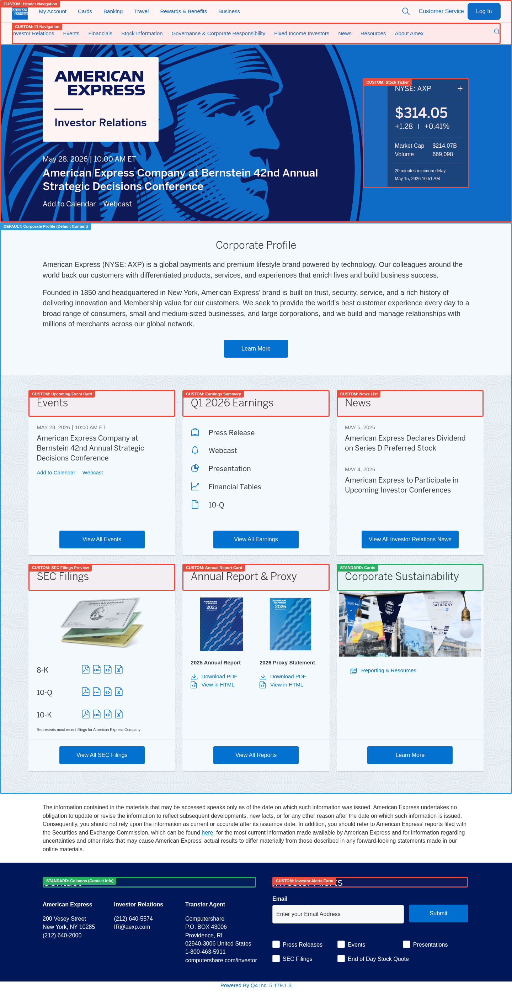

| Block | Type |
|-------|------|
| Hero (home) | Custom — uses the `hero (home)` variant with upcoming event card + stock ticker (see Global Blocks) |
| Corporate Profile | Default Content |
| Upcoming Event Card | Custom — events section card with date/time, title, webcast/calendar links |
| Earnings Summary | Custom |
| News List | Custom |
| SEC Filings Preview | Custom |
| Annual Report Card | Custom |
| Sustainability Card | Standard: **Cards** |

---

## 2. Events

**URL:** `https://ir.americanexpress.com/events/default.aspx`

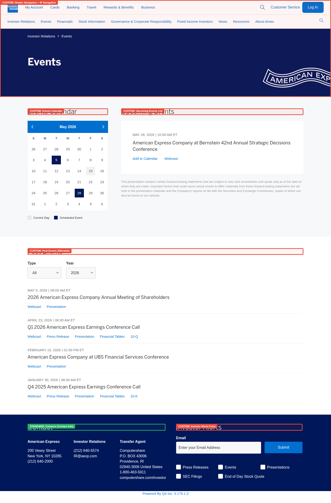

| Block | Type |
|-------|------|
| Events Calendar | Custom — interactive calendar widget with scheduled event indicators |
| Upcoming Events List | Custom — event cards with date/time, title, webcast and calendar links |
| Past Events (filterable) | Custom — filter by Type (All/Earnings/Conference/Investor Day/Other) and Year |

---

## 3. Earnings & SEC Filings

**URL:** `https://ir.americanexpress.com/financials/earnings-and-sec-filings/default.aspx`

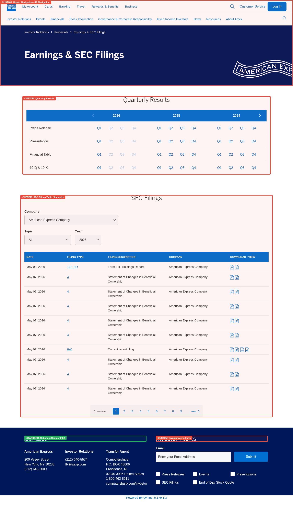

| Block | Type |
|-------|------|
| Quarterly Results | Custom — earnings downloads (Press Release, Webcast, Presentation, Financial Tables, 10-Q) |
| Filterable Data Table (sec-filings) | Custom — `filterable-data-table` variant with Company/Type/Year filters and Date/Filing Type/Description/Company/Download columns |

---

## 4. Annual Reports & Proxy Statements

**URL:** `https://ir.americanexpress.com/financials/annual-reports-and-proxy-statements/default.aspx`

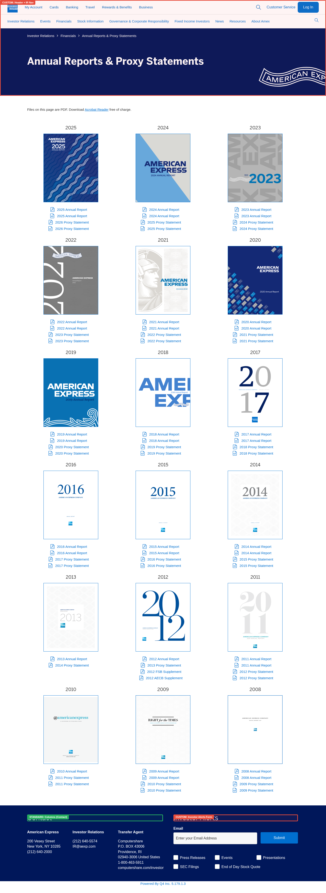

| Block | Type |
|-------|------|
| Annual Reports Gallery | Custom — year-by-year gallery with cover thumbnails, PDF/HTML download links for report and proxy |

---

## 5. Insider Filings

**URL:** `https://ir.americanexpress.com/financials/insider-filings/default.aspx`

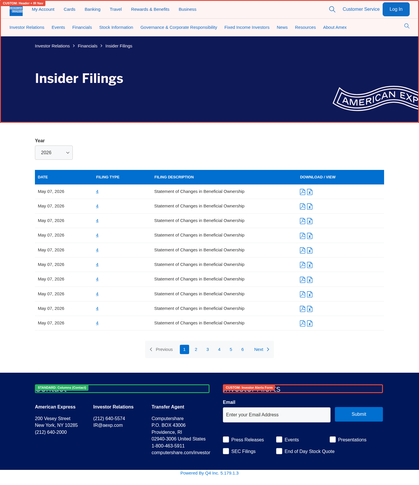

| Block | Type |
|-------|------|
| Filterable Data Table (insider-filings) | Custom — `filterable-data-table` variant with Year filter and Date/Filing Type/Description/Download columns |

---

## 6. Pillar 3 Disclosures

**URL:** `https://ir.americanexpress.com/financials/pillar-3-disclosures/default.aspx`

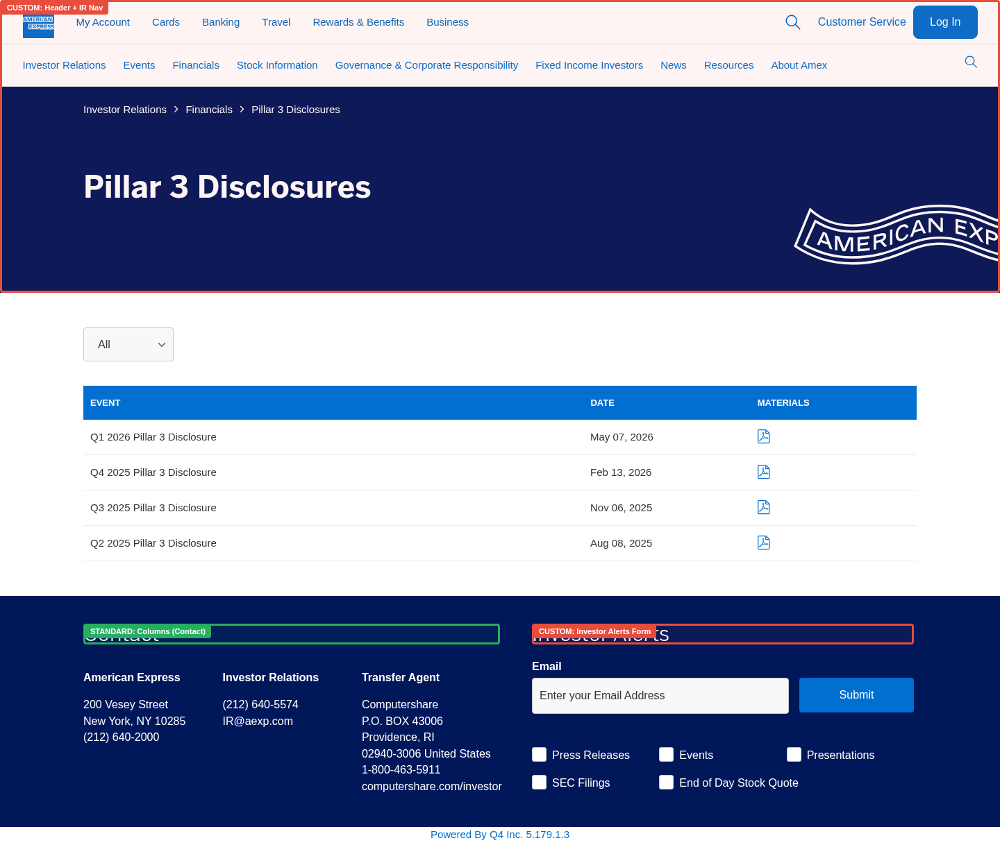

| Block | Type |
|-------|------|
| Year Selector + Documents | Custom — year dropdown with downloadable document list |

---

## 7. LCR Disclosures

**URL:** `https://ir.americanexpress.com/financials/lcr-disclosures/default.aspx`

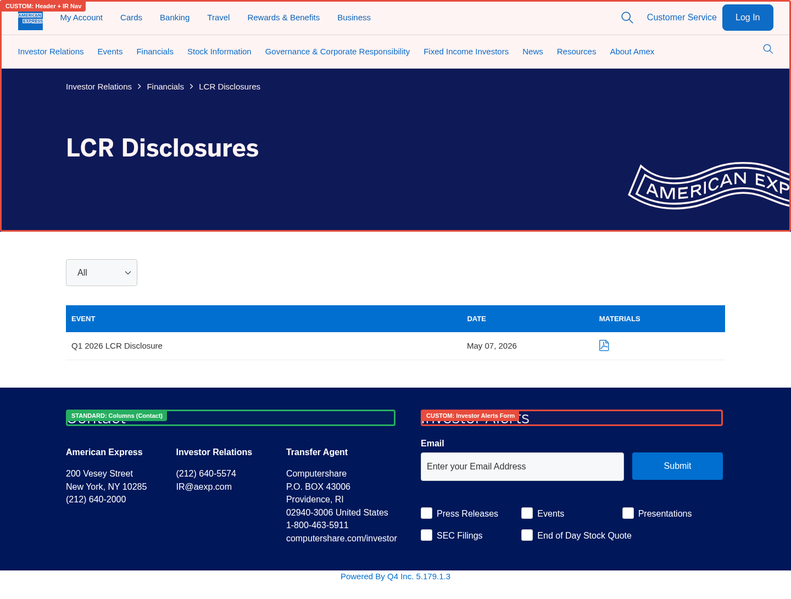

| Block | Type |
|-------|------|
| Year Selector + Documents | Custom — same reusable block as Pillar 3 |

---

## 8. Stock Information

**URL:** `https://ir.americanexpress.com/stock-information/default.aspx`

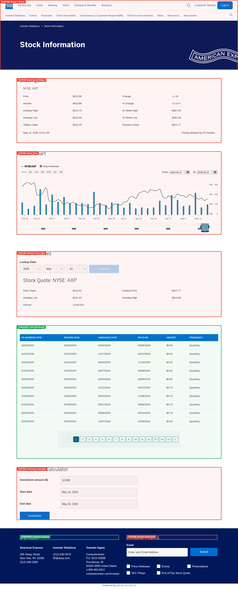

| Block | Type |
|-------|------|
| Stock Ticker | Custom — NYSE:AXP price, change, market cap, volume |
| Stock Quote Widget | Custom — detailed quote with open/high/low/close |
| Stock Chart | Custom — interactive chart with time range and index comparison |
| Historic Prices Table | Custom — date-range filtered table of daily prices |
| Dividends Table | Standard: **Table** — Ex-Div Date, Record Date, Payment Date, Amount, Frequency |
| Investment Calculator | Custom — investment modeling tool with S&P/Nasdaq/Dow comparison |

---

## 9. Executive Committee & Directors

**URL:** `https://ir.americanexpress.com/governance-and-corporate-responsibility/executive-committee-and-directors/default.aspx`

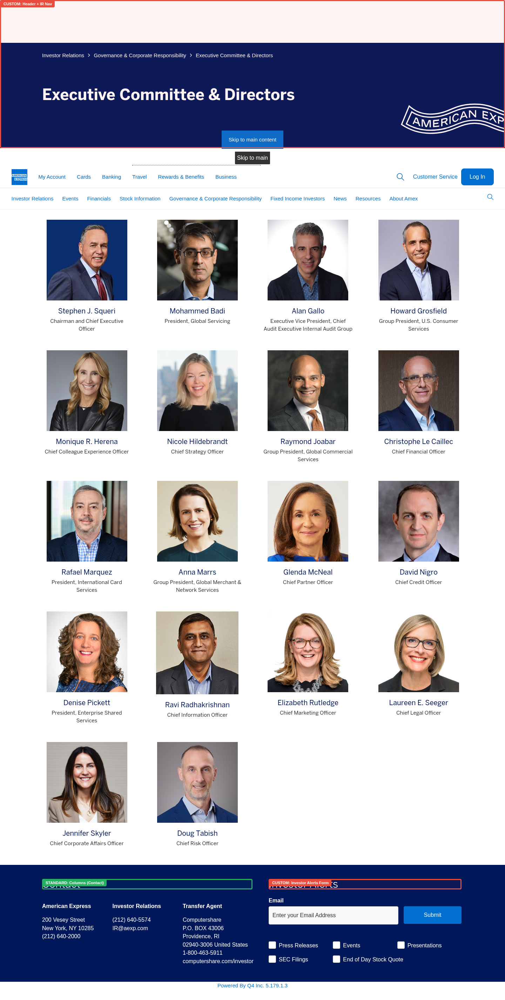

| Block | Type |
|-------|------|
| Executive Profiles (Tabbed) | Custom — tabbed interface (Executive Committee / Board of Directors) with photo, name, title, bio cards |

---

## 10. Governance Framework

**URL:** `https://ir.americanexpress.com/governance-and-corporate-responsibility/governance-framework/default.aspx`

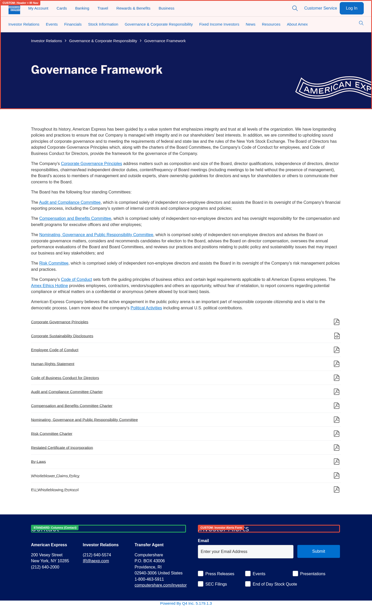

| Block | Type |
|-------|------|
| Governance Intro | Default Content — rich text with paragraphs and inline links describing governance philosophy and committees |
| Document List | Custom — repeating rows of document title (link) + file-type icon (PDF/external), used for charters, policies, and bylaws |

---

## 11. Committee Composition

**URL:** `https://ir.americanexpress.com/governance-and-corporate-responsibility/committee-composition/default.aspx`

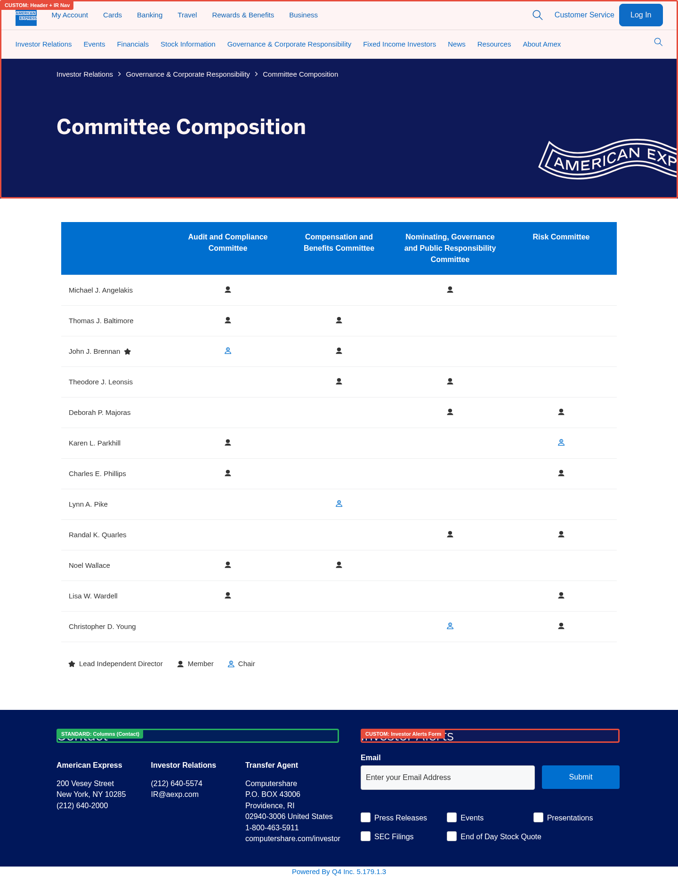

| Block | Type |
|-------|------|
| Committee Composition Matrix | Standard: **Table (bordered)** — members vs. committees with Member/Chair/Lead Director designations |

---

## 12. Shareholder Engagement

**URL:** `https://ir.americanexpress.com/governance-and-corporate-responsibility/shareholder-engagement/default.aspx`

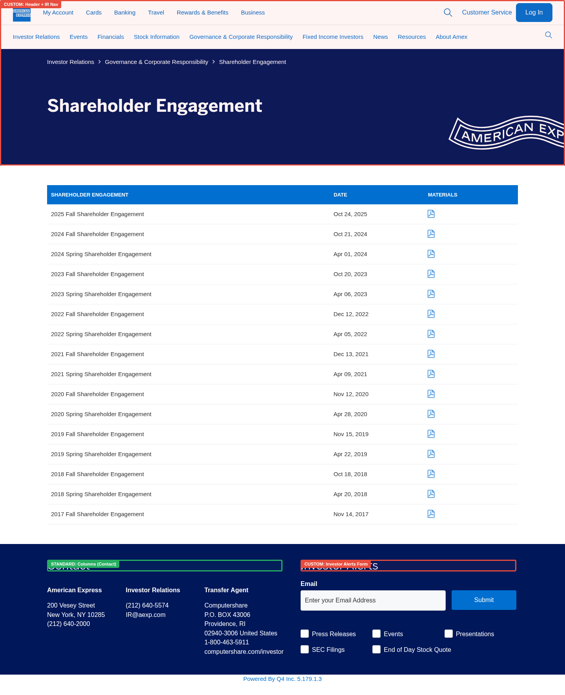

| Block | Type |
|-------|------|
| Shareholder Engagement Content | Default Content — minimal/placeholder page content |

---

## 13. Reporting & Resources

**URL:** `https://ir.americanexpress.com/governance-and-corporate-responsibility/reporting-and-resources/default.aspx`

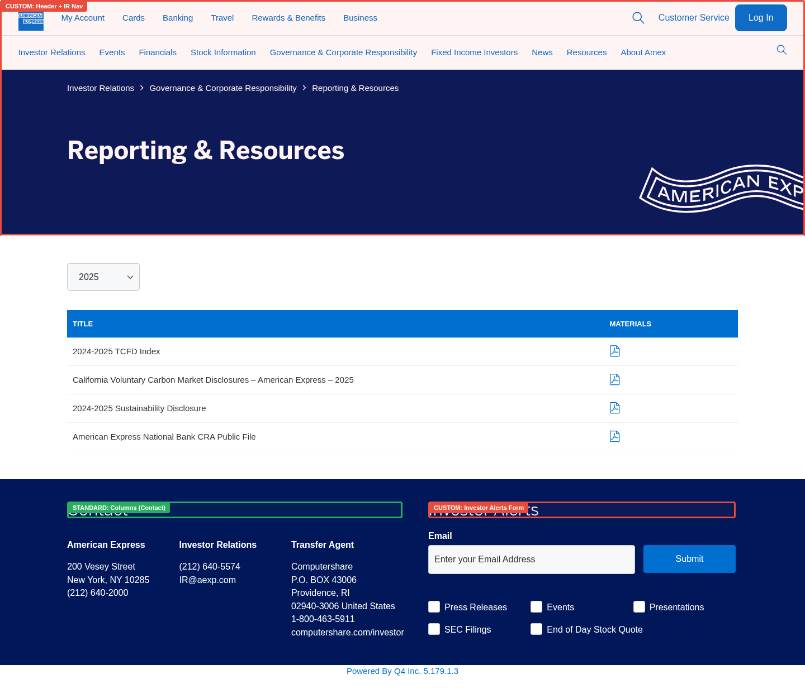

| Block | Type |
|-------|------|
| Year Selector + Documents | Custom — same reusable block as Pillar 3 and LCR pages |

---

## 14. Policy Engagement & Political Activity

**URL:** `https://ir.americanexpress.com/governance-and-corporate-responsibility/policy-engagement-and-political-activity/default.aspx`

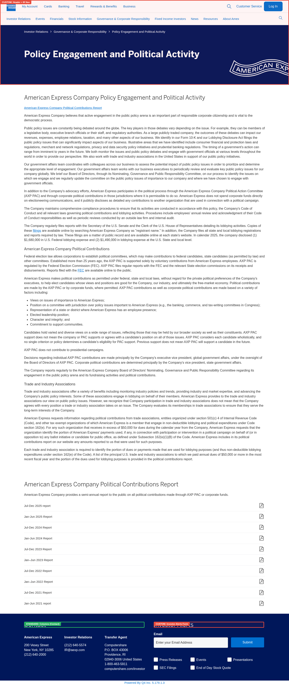

| Block | Type |
|-------|------|
| Policy Engagement Intro | Default Content — rich text with headings, paragraphs, inline links, and bulleted criteria lists |
| Document List | Custom — reused block, here showing semi-annual Political Contributions Reports (10 PDF links) |

---

## 15. Fixed Income Investors

**URL:** `https://ir.americanexpress.com/fixed-income-investors/default.aspx`

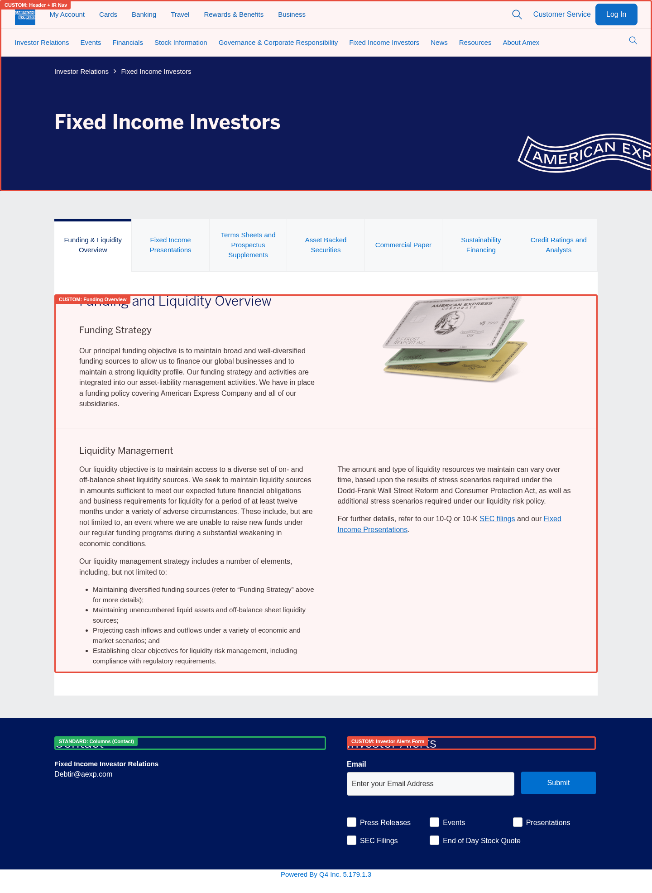

This page uses a **7-tab layout** controlled by an anchor navigation sidebar. Each tab is a distinct section containing one or more blocks inside it.

The overall page structure is a **Tabs** block (standard EDS Tabs), with each tab's content composed of the blocks listed below.

### Tab 1: Funding & Liquidity Overview

| Block | Type |
|-------|------|
| Funding Strategy | Default Content — heading, paragraph, and image side by side |
| Liquidity Management | Default Content — heading, paragraphs, bullet list, and inline links to SEC filings |

### Tab 2: Fixed Income Presentations

| Block | Type |
|-------|------|
| Year Selector + Documents | Custom (reused) — year dropdown with dated PDF downloads |

### Tab 3: Term Sheets & Prospectus Supplements

| Block | Type |
|-------|------|
| Filterable Data Table (term-sheets) | Custom — `filterable-data-table` variant with Type/Year filters and Issuer/CUSIP-ISIN/Rate Type/Maturity Year/Description/Term Sheet PDF/Prospectus PDF columns. 179 rows of debt securities |

### Tab 4: Asset Backed Securities

| Block | Type |
|-------|------|
| ABS Intro | Default Content — paragraph describing securitization + image link to Credit Account Master Trust slide |
| ABS Disclaimers | Default Content — 4 subsections of legal text (No Offer, Information Subject to Change, Offering Docs, Investment Considerations) |
| Credit Account Master Trust — Program Documents | Custom: **Document List** (reused) — Pooling & Servicing Agreement, Receivables Purchase Agreement PDFs |
| Credit Account Master Trust — Servicer Reports | Custom: **Year Selector + Documents** (reused) — year dropdown with monthly servicer report PDFs |
| Credit Account Master Trust — Performance Trends | Custom: **Year Selector + Documents** (reused) — year dropdown with monthly performance trend PDFs |
| Credit Account Master Trust — CUSIP Lookup | Link to CUSIP lookup page |
| Issuance Trust II — Program Documents | Custom: **Document List** (reused) — Indenture, Receivables Purchase Agreement, Servicing Agreement, Transfer Agreement, Trust Agreement PDFs |
| Issuance Trust II — Servicer Reports | Custom: **Year Selector + Documents** (reused) — year dropdown with monthly servicer report PDFs |
| Issuance Trust II — Performance Trends | Custom: **Year Selector + Documents** (reused) — year dropdown with monthly performance trend PDFs |
| ABS SEC Filings | Default Content — links to Credit Account Master Trust and Issuance Trust II SEC filings on sec.gov |
| ABS CUSIP Lookup | Link to CUSIP lookup page |

### Tab 5: Commercial Paper

| Block | Type |
|-------|------|
| Issuer / Offering | Default Content — heading + paragraph describing the issuer and offering terms |
| Commercial Paper Ratings | Standard: **Table** — Issuing Entity, Instrument, Moody's, S&P, Fitch ratings |
| Distribution / Maturities / Denomination / Settlement | Default Content — series of heading + paragraph pairs with terms |
| Rate Info | Standard: **Table** — Service (Bloomberg) and Command (BOOM [go]) |
| Dealer Contact Info | Standard: **Columns** — 3 dealer/issuer contacts with name, address, phone as rich text |

### Tab 6: Sustainability Financing

| Block | Type |
|-------|------|
| Document List | Custom (reused) — 5 dated PDF downloads: 2024 and 2023 Sustainability Financing Reports, Framework, Second Party Opinion, ESG Reports link |

### Tab 7: Credit Ratings & Analysts

| Block | Type |
|-------|------|
| Credit Ratings Table | Standard: **Table** — ratings matrix by Moody's/S&P/Fitch for 4 AXP entities (AXP, TRS, National Bank, Credit Corp) with Long-Term, Short-Term, and Outlook rows |
| Analyst Contacts | Standard: **Columns** — 3 columns (Fitch, Moody's, S&P) each with firm name/link, primary contact, and ABS-specific contact as rich text |

---

## 16. Investor Relations News

**URL:** `https://ir.americanexpress.com/news/investor-relations-news/default.aspx`

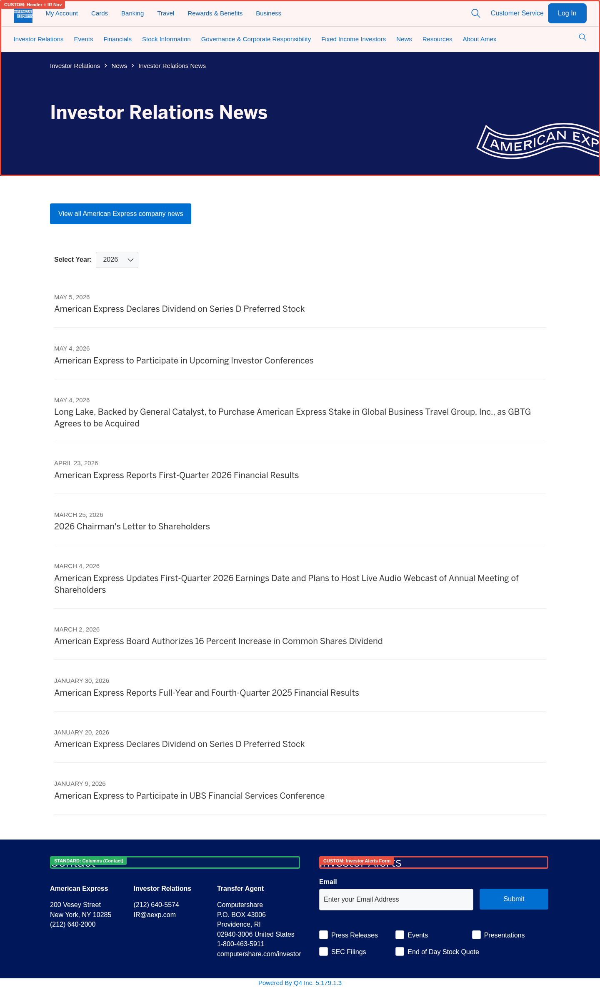

| Block | Type |
|-------|------|
| News Archive | Custom — year-filtered list of press releases with dates and links |

---

## 17. Sign Up for Email Alerts

**URL:** `https://ir.americanexpress.com/resources/sign-up-for-email-alerts/default.aspx`

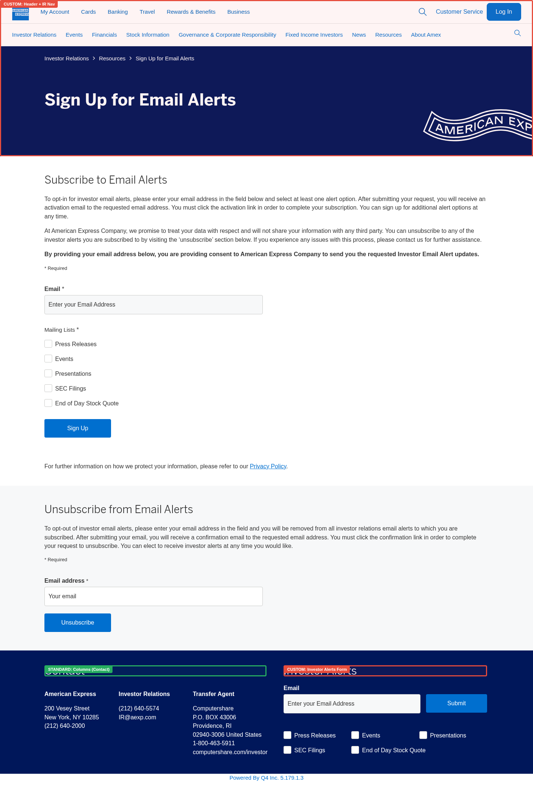

| Block | Type |
|-------|------|
| Email Alerts Form (Full Page) | Custom — subscribe + unsubscribe sections with alert preference checkboxes and privacy link |

---

## 18. FAQ

**URL:** `https://ir.americanexpress.com/resources/faq/default.aspx`

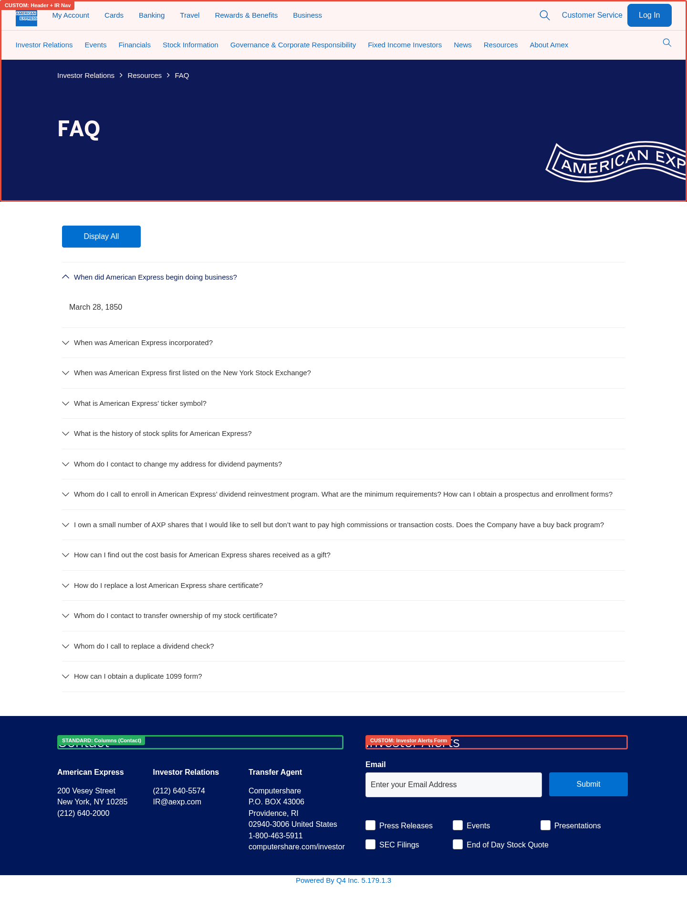

| Block | Type |
|-------|------|
| FAQ | Standard: **Accordion** — expandable question/answer sections |

---

## 19. Shareholder Services

**URL:** `https://ir.americanexpress.com/resources/shareholder-services/default.aspx`

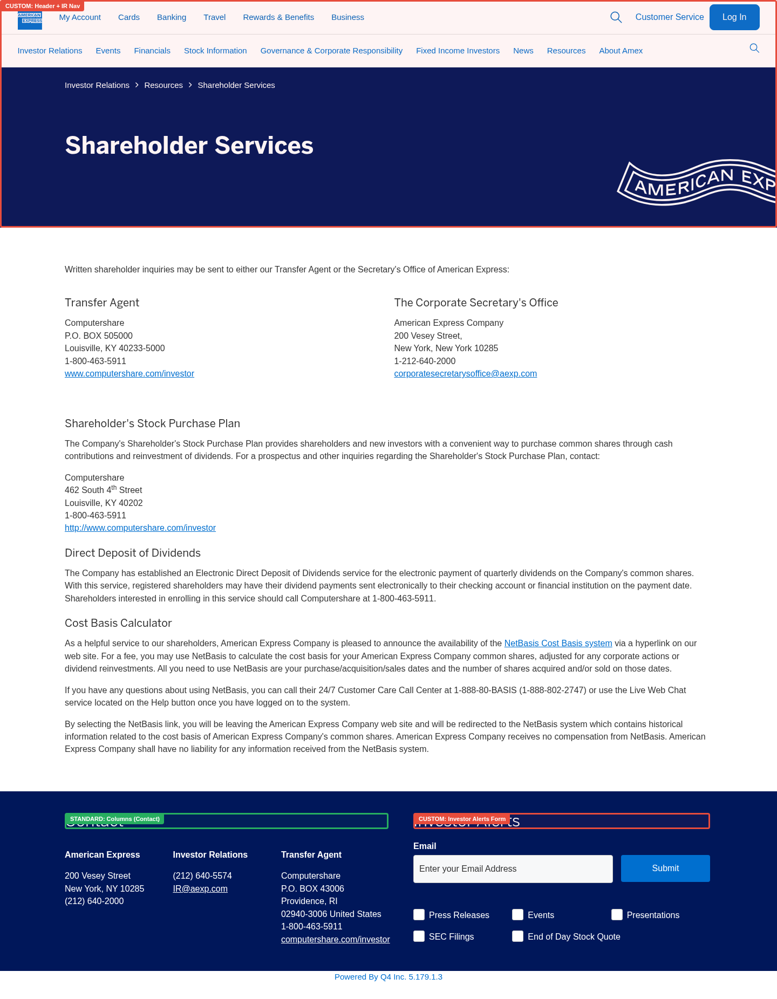

| Block | Type |
|-------|------|
| Shareholder Services Content | Default Content — rich text covering transfer agent, stock purchase plan, dividend direct deposit, cost basis calculator |

---

## 20. Information Request

**URL:** `https://ir.americanexpress.com/resources/information-request/default.aspx`

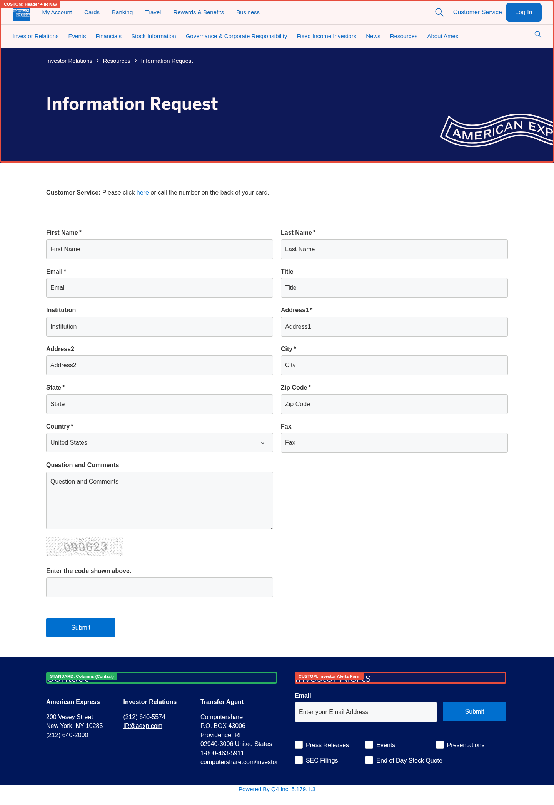

| Block | Type |
|-------|------|
| Information Request Form | Custom — multi-field form (name, email, title, institution, address, country, fax, comments, CAPTCHA) |

---

## 21. Our Contact Information

**URL:** `https://ir.americanexpress.com/resources/our-contact-information/default.aspx`

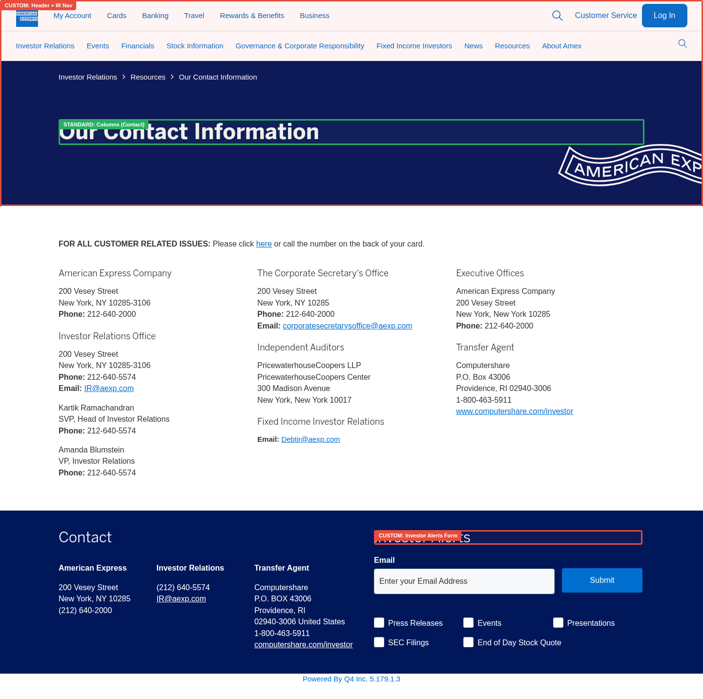

| Block | Type |
|-------|------|
| Detailed Contact Directory | Standard: **Columns** — multi-section layout with HQ, IR Office, Corporate Secretary, Auditors, Fixed Income IR, Transfer Agent |

---

## 22. News Detail Pages (template)

**URL pattern:** `https://ir.americanexpress.com/news/investor-relations-news/investor-relations-news-details/{year}/{slug}/default.aspx`

All individual news/press release pages share the same template. No screenshot — they are dynamic detail pages, not in the static 22-page list.

| Block | Type |
|-------|------|
| Headline + Date | Default Content — article title (H1) and publication date |
| Press Release Body | Default Content — rich text (paragraphs, bullet points, dateline). Varies per article |
| About American Express | Default Content — boilerplate company description, identical on every article. Could be authored as a shared fragment |
| Reference Links | Default Content — links to americanexpress.com, newsroom, and IR site |
| Media / Investor Contacts | Standard: **Columns** — named contacts (2-4 people) with role, email, and phone split into Media and Investor/Analyst columns |

**Authoring note:** The "About American Express" boilerplate and contact block are identical across all articles. Consider authoring these as a shared content fragment so they only need to be updated in one place.

---

## Summary

| Category | Count |
|----------|-------|
| Custom blocks (need to build) | 23 |
| Standard EDS blocks (reusable) | 5 (Table, Table bordered, Columns, Cards, Accordion) |
| Default Content (no block) | 12 |
| **Total distinct blocks** | **40** |

### Custom Blocks That Are Reused Across Pages

| Custom Block | Pages |
|-------------|-------|
| Hero | All 22 pages — `hero (home)` variant on IR Home (with event card + stock ticker), base `hero` variant on 21 interior pages (breadcrumb + title) |
| Stock Ticker | IR Home (inside hero), Stock Information (standalone) |
| News List | IR Home, News |
| SEC Filings Preview | IR Home, Earnings & SEC Filings |
| Annual Report Card | IR Home, Annual Reports |
| Filterable Data Table | Earnings & SEC Filings (`sec-filings` variant), Insider Filings (`insider-filings` variant), Fixed Income tab 3 (`term-sheets` variant) |
| Year Selector + Documents | Pillar 3, LCR, Reporting & Resources, Fixed Income (Presentations tab, ABS Servicer Reports, ABS Performance Trends) |
| Document List | Governance Framework, Policy Engagement, Fixed Income (Sustainability Financing tab, ABS program docs) |
| Investor Alerts Form | All 22 pages (global footer) |
| Header Navigation | All 22 pages (global) |
| IR Navigation | All 22 pages (global) |

---

## Data Architecture: Sheets & Asset Overlap

Since all assets will be hosted in AEM (not external CDNs), sheets serve as the central data source for dynamic blocks. Several sheets feed multiple blocks across different pages — an author adds a row once and it appears everywhere.

### Shared Sheets (one sheet, multiple consumers)

| Sheet | Full Listing Page | Home Page Summary Block | How Home Block Reads It |
|-------|-------------------|------------------------|------------------------|
| **sec-filings.xlsx** | Earnings & SEC Filings — Filterable Data Table (all rows, Company/Type/Year filters) | IR Home — SEC Filings Preview (latest 3: 8-K, 10-Q, 10-K) | Block JS queries sheet for most recent row per filing type |
| **sec-filings.xlsx** | *(same sheet)* | IR Home — Earnings Summary (latest quarter's PDFs) | Block JS queries sheet for most recent quarterly filing row, renders its press release/webcast/presentation/tables/10-Q links |
| **events.xlsx** | Events page — Events Calendar + Upcoming Events + Past Events (all rows, Type/Year filters) | IR Home — Hero (home) upcoming event + Upcoming Event Card | Block JS queries sheet for next future-dated event |
| **news.xlsx** | News page — News Archive (all rows, Year filter) | IR Home — News List (latest 2-3 items) | Block JS queries sheet sorted by date descending, takes first N |

### Dedicated Sheets (one sheet, one page)

| Sheet | Page | Block |
|-------|------|-------|
| **insider-filings.xlsx** | Insider Filings | Filterable Data Table (insider-filings variant) |
| **term-sheets.xlsx** | Fixed Income (Tab 3) | Filterable Data Table (term-sheets variant) |
| **pillar3-disclosures.xlsx** | Pillar 3 Disclosures | Year Selector + Documents |
| **lcr-disclosures.xlsx** | LCR Disclosures | Year Selector + Documents |
| **fi-presentations.xlsx** | Fixed Income (Tab 2) | Year Selector + Documents |
| **abs-servicer-reports-master.xlsx** | Fixed Income (Tab 4 — Credit Account Master Trust) | Year Selector + Documents |
| **abs-performance-master.xlsx** | Fixed Income (Tab 4 — Credit Account Master Trust) | Year Selector + Documents |
| **abs-servicer-reports-issuance.xlsx** | Fixed Income (Tab 4 — Issuance Trust II) | Year Selector + Documents |
| **abs-performance-issuance.xlsx** | Fixed Income (Tab 4 — Issuance Trust II) | Year Selector + Documents |
| **reporting-resources.xlsx** | Reporting & Resources | Year Selector + Documents |

### Authored Directly in Block (no sheet needed)

These change rarely and have few rows — authors edit them inline in the page document:

| Block | Page(s) | Why no sheet |
|-------|---------|--------------|
| Document List | Governance Framework (13 docs), Policy Engagement (10 docs), FI Sustainability (5 docs), FI ABS Program Docs (2-6 docs each) | Small lists, updated ~1x/year |
| Dividends Table | Stock Information | ~4 rows/year, manually added |
| Committee Composition | Committee Composition | Changes with board elections |
| Credit Ratings Table | Fixed Income (Tab 7) | Changes only on rating actions |
| Commercial Paper Ratings | Fixed Income (Tab 5) | Rarely changes |
| Rate Info Table | Fixed Income (Tab 5) | 2 rows, essentially static |

### Asset Folder Structure

All downloaded assets live in AEM under a consistent path convention. Sheet rows reference these paths — authors upload the file and add the path to the sheet row.

```
/assets/
  /sec-filings/{year}/{quarter}/          ← 8-K.pdf, 10-Q.pdf, 10-Q.xbrl.zip, etc.
  /earnings/{year}/{quarter}/             ← press-release.pdf, presentation.pdf, financial-tables.pdf
  /insider-filings/{year}/                ← insider filing PDFs
  /term-sheets/                           ← term-sheet and prospectus PDFs by CUSIP
  /annual-reports/{year}/                 ← annual-report.pdf, proxy-statement.pdf
  /disclosures/pillar3/{year}/            ← quarterly disclosure PDFs
  /disclosures/lcr/{year}/                ← quarterly LCR PDFs
  /fixed-income/presentations/{year}/     ← monthly presentation PDFs
  /fixed-income/abs/servicer-reports/     ← monthly by trust and year
  /fixed-income/abs/performance-trends/   ← monthly by trust and year
  /fixed-income/abs/program-docs/         ← pooling agreements, indentures, etc.
  /governance/                            ← charters, code of conduct, bylaws, etc.
  /political-contributions/               ← semi-annual reports
  /sustainability/                        ← financing reports, framework PDF
```

---

## Migration Phases

### Phase 1: Block Development

Build all custom and standard blocks with functional JS and basic CSS. No content yet — blocks are developed against mock/sample data.

**Global blocks:**
- [ ] Header Navigation + IR Navigation (`nav.html`)
- [ ] Hero block (base variant + home variant)
- [ ] Investor Alerts Form
- [ ] Contact Information (standard Columns)

**Sheet-driven blocks:**
- [ ] Filterable Data Table (3 variants: sec-filings, insider-filings, term-sheets)
- [ ] Year Selector + Documents
- [ ] Events Calendar (calendar widget + upcoming/past events with filters)
- [ ] News List / News Archive
- [ ] Earnings Summary
- [ ] SEC Filings Preview

**Authored blocks:**
- [ ] Document List
- [ ] Annual Report Card
- [ ] Annual Reports Gallery
- [ ] Upcoming Event Card
- [ ] Stock Ticker (standalone, for Stock Information page)
- [ ] Stock Quote Widget
- [ ] Stock Chart
- [ ] Historic Prices Table
- [ ] Investment Calculator
- [ ] Executive Profiles (tabbed)
- [ ] Funding Overview
- [ ] ABS Section
- [ ] Commercial Paper
- [ ] Email Alerts Form (Full Page)
- [ ] Information Request Form

**Standard EDS blocks (configure/style only):**
- [ ] Table (+ bordered variant)
- [ ] Columns
- [ ] Cards
- [ ] Accordion
- [ ] Tabs (for Fixed Income page)

**Deliverable:** All blocks render correctly with sample data in the local dev server.

---

### Phase 2: Content Migration

Import all page content, populate sheets, upload assets to AEM, and wire everything together.

**Assets:**
- [ ] Upload 678 downloaded assets to AEM DAM under `/assets/` folder structure
- [ ] Verify asset paths resolve correctly

**Sheets:**
- [ ] Create and populate shared sheets: `sec-filings.xlsx`, `events.xlsx`, `news.xlsx`
- [ ] Create and populate dedicated sheets: `insider-filings.xlsx`, `term-sheets.xlsx`, `pillar3-disclosures.xlsx`, `lcr-disclosures.xlsx`, `fi-presentations.xlsx`, `abs-servicer-reports-master.xlsx`, `abs-performance-master.xlsx`, `abs-servicer-reports-issuance.xlsx`, `abs-performance-issuance.xlsx`, `reporting-resources.xlsx`
- [ ] Update all asset URLs in sheets to point to AEM DAM paths

**Pages (22 static + news detail template):**
- [ ] IR Home
- [ ] Events
- [ ] Earnings & SEC Filings
- [ ] Annual Reports & Proxy Statements
- [ ] Insider Filings
- [ ] Pillar 3 Disclosures
- [ ] LCR Disclosures
- [ ] Stock Information
- [ ] Executive Committee & Directors
- [ ] Governance Framework
- [ ] Committee Composition
- [ ] Shareholder Engagement
- [ ] Reporting & Resources
- [ ] Policy Engagement & Political Activity
- [ ] Fixed Income Investors (7 tabs)
- [ ] Investor Relations News
- [ ] Sign Up for Email Alerts
- [ ] FAQ
- [ ] Shareholder Services
- [ ] Information Request
- [ ] Our Contact Information
- [ ] News Detail pages (template + sample articles)

**Deliverable:** All pages render with real content and data in the preview environment. Sheets are populated. Assets are accessible.

---

### Phase 3: Design & Styling

Match the original site's visual design — colors, typography, spacing, layout.

**Site-level design tokens:**
- [ ] Typography (font families, sizes, weights, line heights)
- [ ] Color palette (AmEx blue, grays, link colors, backgrounds)
- [ ] Spacing scale (margins, padding, section gaps)
- [ ] Breakpoints and responsive behavior

**Global component styling:**
- [ ] Header Navigation + IR Navigation
- [ ] Hero (both variants — home and interior)
- [ ] Footer (Contact Columns + Investor Alerts Form)
- [ ] Disclaimer text styling

**Block-by-block styling:**
- [ ] Style each custom block to match original page appearance
- [ ] Style standard blocks (Table, Columns, Cards, Accordion, Tabs) with IR theme
- [ ] Responsive behavior for all blocks at tablet and mobile breakpoints

**Page-level layout:**
- [ ] IR Home grid layout (2-column and 3-column content sections)
- [ ] Interior page layouts (full-width content pane)
- [ ] Fixed Income tabbed page layout

**Deliverable:** Side-by-side visual comparison with original site passes review. Responsive design works across breakpoints.

---

### Phase 4: QA & Finalization

Polish, test, fix, and prepare for go-live.

**Content QA:**
- [ ] Verify all links point to correct assets/pages (no broken links)
- [ ] Verify all sheet-driven data displays correctly with filters
- [ ] Proofread authored content against original site
- [ ] Validate news detail page template with multiple articles

**Cross-browser / device testing:**
- [ ] Chrome, Safari, Firefox, Edge
- [ ] Mobile (iOS Safari, Android Chrome)
- [ ] Tablet breakpoints

**Performance:**
- [ ] Lighthouse audit (target 90+ on all scores)
- [ ] Asset optimization (image compression, lazy loading)
- [ ] Core Web Vitals pass (LCP, CLS, INP)

**Accessibility:**
- [ ] Keyboard navigation for all interactive blocks (filters, tabs, calendar)
- [ ] Screen reader testing for data tables and forms
- [ ] Color contrast compliance (WCAG 2.1 AA)

**Go-live prep:**
- [ ] DNS/domain configuration
- [ ] Redirect mapping (old Q4 URLs to new EDS paths)
- [ ] SEO metadata and Open Graph tags
- [ ] Analytics integration
- [ ] Author training / handover documentation

**Deliverable:** Production-ready site with all QA checks passed, redirects in place, and authors trained.
